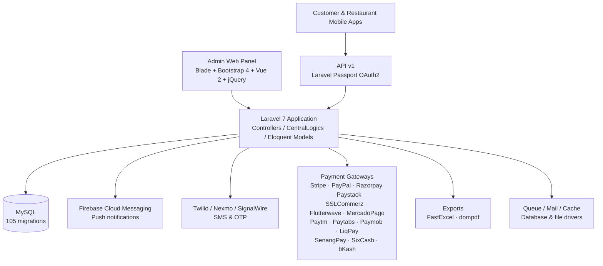

<p align="center">
  
</p>

<p align="center">
  
  
  
  
  
  
  
  
</p>

> **Developed by [Arslan Malik](https://github.com/arsalanmaalik461)**
> 📱 WhatsApp: [+92 300 8987448](https://wa.me/923008987448) · 🌐 Website: [arslanmalik.tech](https://arslanmalik.tech)

---

## 🌟 Executive Overview

**Yankee Admin Panel** is the web-based administration backend of the Yankee multi-restaurant food delivery platform, built on **Laravel 7 (PHP 7.2+) with MySQL** and a **Blade + Bootstrap 4 + Vue 2** frontend. From a single dashboard, the central admin — and branch-level staff with role-based access — can run the entire food business: restaurants and branches, menus (categories, items, add-ons, attributes), the full order lifecycle (online, POS walk-in, parcel delivery), delivery men with live tracking and earnings, customers with wallets and loyalty points, and marketing campaigns, coupons, and banners.

The panel exposes a **REST API v1 secured by Laravel Passport (OAuth2)** that powers the customer and restaurant mobile apps, with **Firebase Cloud Messaging** push notifications, **Twilio / Nexmo SMS** (OTP verification), and **14+ payment gateways** including Stripe, PayPal, Razorpay, Paystack, SSLCommerz, Flutterwave, MercadoPago, Paytm, Paytabs, Paymob, LiqPay, SenangPay, SixCash, and bKash. Business intelligence comes from an analytics dashboard plus detailed order, earnings, delivery-man, and transaction reports exportable to Excel and PDF.

Beyond day-to-day operations, the system ships with built-in **installation and update wizards**, multilingual/translation management, custom employee roles and permissions, and even **QR-code table ordering** for dine-in service — making it a complete, self-contained restaurant commerce suite.

---

## 📑 Table of Contents

- [✨ Key Features & Highlights](#-key-features--highlights)
- [🖥️ Feature Showcase](#️-feature-showcase)
- [🏗️ System Architecture](#️-system-architecture)
- [🚀 Quickstart & Installation Guide](#-quickstart--installation-guide)
- [📂 Project Structure](#-project-structure)
- [🛡️ Security & Notes](#️-security--notes)

---

## ✨ Key Features & Highlights

| Feature | Description |
| :--- | :--- |
| 🏪 Multi-Branch Restaurant Management | Manage restaurants, branches, restaurant areas, and opening hours (`RestorantController`, `BranchController`, `RestoareasController`) |
| 🍔 Menu Management | Categories, food items/products, add-ons, and attributes with images and discounts (`ItemController`, `ProductController`, `CategoryController`, `AddOnController`, `AttributeController`) |
| 🧾 Order Lifecycle | Full order pipeline — details, status flow, delivery histories, cancellations, and finance reconciliation (`OrderController`, `FinanceController`) |
| 🛒 Point of Sale (POS) | In-store walk-in / dine-in billing with cart support (`POSController`, `CartController`) |
| 📱 QR Table Ordering | QR-code based table ordering for dine-in guests (`QRController`, `TablesController`) |
| 🛵 Delivery Network | Delivery-man onboarding, live order tracking, and earnings/payout management (`DeliveryManController`, `TrackDeliverymanController`, `ProvideDMEarningController`) |
| 👥 Customer Management | Customer profiles, addresses, wallets, loyalty points, live chat conversations, reviews, and wishlists (`CustomerController`, `CustomerWalletController`, `LoyaltyPointController`, `ConversationController`) |
| 📣 Marketing Suite | Campaigns, coupons, discounts, offers, banners, newsletters, and testimonials (`CampaignController`, `CouponController`, `DiscountController`, `BannerController`, `NewsletterController`) |
| 📦 Parcel Delivery Module | Parcel categories and parcel order handling alongside food orders (`ParcelController`, `ParcelCategoryController`) |
| 📊 Analytics & Reports | Admin dashboard analytics plus order/earnings/deliveryman reports with Excel (FastExcel) and PDF (dompdf) export (`AnalyticController`, `ReportController`) |
| 💳 14+ Payment Gateways | Stripe, PayPal, Razorpay, Paystack, SSLCommerz, Flutterwave, MercadoPago, Paytm, Paytabs, Paymob, LiqPay, SenangPay, SixCash, bKash (`PaymentController` + gateway controllers) |
| 🔔 Push & SMS Notifications | Firebase Cloud Messaging push + Twilio/Nexmo/SignalWire SMS, incl. phone OTP verification (`SmsController`, `PhoneVerificationController`, `NotificationChannels`) |
| 🔐 Roles & Employees | Custom roles with granular permissions, employee accounts, branch-scoped staff (`CustomRoleController`, `EmployeeController`) |
| 🌐 Multilingual Support | Language management and translation helper for UI strings (`LanguageController`, `CentralLogics/Translation.php`) |
| 📲 Mobile API v1 | REST API for customer/restaurant apps with Laravel Passport OAuth2 (`routes/api/v1`) |
| 🧰 Admin Utilities | File manager, business/SMS/social-media/location settings, pages, delivery charge config (`FileManagerController`, `BusinessSettingsController`) |
| ⚙️ Install & Update Wizards | Guided web-based installer and updater (`InstallController`, `UpdateController`, `routes/install.php`, `routes/update.php`) |

---

## 🖥️ Feature Showcase

### 1. Order, POS & Table Management

> *"Every order — online, walk-in, or dine-in — flows through one screen."*

- Complete order pipeline with statuses, order details, delivery history, and finance reconciliation
- Built-in **POS** for counter billing with cart, discounts, and taxes
- **QR table ordering** so dine-in guests can order from their phones
- Parcel delivery orders handled in the same pipeline

### 2. Delivery Network Operations

> *"Track every rider, settle every earning."*

- Delivery-man registration, approval, and zone assignment
- **Live order tracking** from kitchen to doorstep (`track_deliverymen`, `order_delivery_histories`)
- Earnings ledger and payout management (`ProvideDMEarningController`, `AccountTransactionController`)

### 3. Marketing & Growth Suite

> *"Campaigns, coupons, and loyalty that bring customers back."*

- Time-bound campaigns, discount coupons with usage limits, and special offers
- Homepage banners and promotional pages
- Customer wallets, loyalty-point accrual/redemption, and newsletters

### 4. Payments, Reports & Platform API

> *"Take money any way your customers want to pay — then prove it in a report."*

- **14+ payment gateways**: Stripe, PayPal, Razorpay, Paystack, SSLCommerz, Flutterwave, MercadoPago, Paytm, Paytabs, Paymob, LiqPay, SenangPay, SixCash, bKash
- Analytics dashboard + exportable reports (orders, earnings, transactions) to Excel/PDF
- **API v1** with Passport OAuth2 serving the customer and vendor mobile apps, with Firebase push and SMS OTP

---

## 🏗️ System Architecture



**Request flow:** the admin panel is a server-rendered Blade application with Vue 2 components and Axios calls; mobile clients talk to versioned REST endpoints under `routes/api/v1` authenticated via Passport tokens. Shared business logic lives in `app/CentralLogics/` (orders, products, banners, SMS, translations), Eloquent models map to 100+ tables, and third-party services (FCM, SMS providers, payment gateways) are integrated as dedicated controllers and config entries.

---

## 🚀 Quickstart & Installation Guide

### Prerequisites

- **PHP** ^7.2.5 with extensions: `curl`, `json`, `mbstring`, `openssl`, `pdo_mysql`, `gd`
- **Composer** (a `composer.phar` is also committed at the repo root)
- **MySQL** 5.7+ (default database name in `.env.example`: `delivery_app_db`)
- **Node.js + npm** (Laravel Mix 5 asset pipeline)

### Step-by-Step Installation

```bash
# 1. Clone the repository
git clone https://github.com/arsalanmaalik461/Yankee-admin-panel.git
cd Yankee-admin-panel

# 2. Install PHP dependencies
composer install
# (or: php composer.phar install)

# 3. Configure the environment
cp .env.example .env
# Edit .env: set DB_DATABASE, DB_USERNAME, DB_PASSWORD and APP_URL

# 4. Generate the application key (IMPORTANT — .env.example ships a sample key)
php artisan key:generate

# 5. Run migrations and seeders
php artisan migrate --seed

# 6. Link public storage and build frontend assets
php artisan storage:link
npm install && npm run prod

# 7. Serve the application
php artisan serve
# Visit http://localhost:8000 — or run the web installer at /install
```

> 💡 A guided web installer is included — open `/install` in the browser after step 3 for a step-by-step setup. Payment gateway and SMS credentials are configured in the admin panel under **Business Settings** after installation.

---

## 📂 Project Structure

```
Yankee-admin-panel/
├── app/
│   ├── CentralLogics/        # Shared business logic (order, product, banner, SMS, translation, constants)
│   ├── Console/              # Artisan commands & scheduler
│   ├── Events/  Listeners/   # Domain events (order status, notifications)
│   ├── Exports/  Imports/    # Excel export / import classes
│   ├── Helpers/  Library/    # Helper functions and library classes
│   ├── Http/
│   │   ├── Controllers/      # Web controllers (62 files: POS, payments, SMS, vendor, branch…)
│   │   │   ├── Admin/        # Admin panel controllers (dashboard, orders, reports, POS, campaigns…)
│   │   │   ├── Api/          # Mobile API controllers
│   │   │   └── Auth/         # Authentication controllers
│   │   └── Middleware/
│   ├── Mail/                 # Mailable classes (order emails, verification)
│   ├── Models/               # Eloquent models
│   ├── Notifications/        # Notification classes (FCM, mail, database)
│   ├── NotificationChannels/ # Custom notification channels
│   ├── Providers/            # Service providers
│   ├── Repositories/         # Repository layer
│   ├── Rules/  Scopes/       # Validation rules & global scopes
│   ├── Services/  Traits/    # Services and reusable traits
│   └── Exceptions/
├── bootstrap/                # Framework bootstrap & cached config
├── config/                   # Config (paypal, stripe, razor, paystack, firebase, sslcommerz…)
├── database/
│   ├── migrations/           # 105 migrations (orders, products, delivery men, wallets…)
│   ├── seeds/  factories/
├── public/                   # Web root (assets, firebase-messaging-sw.js)
├── resources/
│   ├── views/                # Blade templates (admin-views, branch-views, installation, update…)
│   ├── js/  sass/  lang/     # Frontend source & translations
├── routes/
│   ├── admin.php             # Admin panel routes
│   ├── api/v1/               # Mobile API v1 routes
│   ├── branch.php            # Branch staff routes
│   ├── web.php               # Public storefront routes
│   ├── install.php  update.php
├── storage/  tests/
├── artisan  server.php  index.php
├── composer.json             # Laravel 7 + Passport + 14 payment/SMS SDKs
├── package.json              # Bootstrap 4, jQuery, Vue 2, Laravel Mix 5
├── webpack.mix.js
├── .env.example
└── docs/
    └── assets/
        └── banner.svg        # Project banner
```

*(Root-level legacy model files such as `Items.php`, `Order.php`, `User.php` sit alongside `app/` — kept for compatibility.)*

---

## 🛡️ Security & Notes

- **Regenerate `APP_KEY`**: `.env.example` ships with a sample key — always run `php artisan key:generate` on a fresh install.
- **Debug mode**: `.env.example` sets `APP_DEBUG=true` — set it to `false` in production.
- **Laravel 7 is past end-of-life** (security fixes ended March 2021). If this panel is internet-facing, plan an upgrade path to a supported Laravel release.
- **Installer/updater exposure**: the `/install` and `/update` wizards are powerful — remove or access-protect them after setup.
- **Never commit `.env`** with real credentials; rotate any keys that were ever committed.
- **Clean housekeeping**: remove the committed `error_log`, and review `php.ini` / `composer.phar` at the repo root before deploying.
- **Default credentials**: change all seeded admin/demo accounts immediately after installation.
- Payment gateway secrets and SMS credentials belong in `.env` / **Business Settings**, never in version control.

---

<p align="center">
  <sub>Developed with ❤️ by <a href="https://github.com/arsalanmaalik461">Arslan Malik</a> · 📱 <a href="https://wa.me/923008987448">WhatsApp: +92 300 8987448</a> · 🌐 <a href="https://arslanmalik.tech">arslanmalik.tech</a></sub>
</p>
